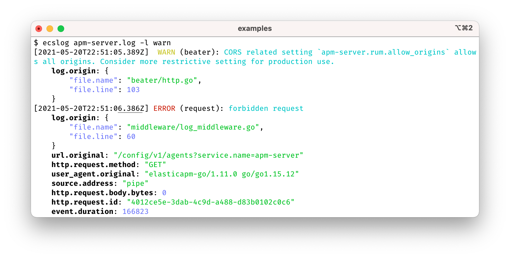

# ecslog

`ecslog` is a CLI for pretty-printing and filtering log files in
[ecs-logging](https://www.elastic.co/guide/en/ecs-logging/overview/master/intro.html)
format. It is a single (Go-implemented) binary, with builds for Linux, Mac, and
Windows. Its default styling should play nice with both light and
dark-background terminals.


# Install

- For homebrew users:

        brew install trentm/tap/ecslog
        # OR 'brew upgrade trentm/tap/ecslog' if you have it already

- Or download a pre-built binary package from [the releases page](https://github.com/trentm/go-ecslog/releases)
  and copy to somewhere on your PATH.

- Or you can build from source via:

        git clone git@github.com:trentm/go-ecslog.git
        cd go-ecslog
        make  # produces "./ecslog", a single binary you can put on your PATH
        ./ecslog --version

Then, try it on a demo log file:

    curl -s https://raw.githubusercontent.com/trentm/go-ecslog/main/demo.log \
        | ecslog

# Introduction

`ecslog` pretty-prints log data in the given file argument(s):

    ecslog /var/log/some.log [other-log-files...]

or passed in on stdin

    node server.js | ecslog
    tail -f /var/log/some.log | ecslog
    docker logs -f my-container | ecslog

The default behaviour can be customised by CLI options (use `ecslog --help` to
list all options) and/or a `~/.ecslog.toml` config file (see
[Configuration](#configuration) below).  The rest of this section describes some
features of ecslog.


## Level filtering

Use `-l LEVEL-NAME` to only show log records at that level or above.



([ECS](https://www.elastic.co/guide/en/ecs/current/ecs-log.html#field-log-level)
does not mandate level names, so `ecslog` uses [a best-effort ordering](https://github.com/trentm/go-ecslog/blob/v0.4.0/internal/ecslog/ecslog.go#L150-L168)
of level names in common usage.)


## KQL filtering

Use `-k KQL` to filter log records using [KQL](https://www.elastic.co/guide/en/kibana/current/kuery-query.html), as you would in Kibana.


Some examples:

- Filter on the "message" field by default: `ecslog ./examples/apm-server.log -k '*ILM*'`
- Filter on logger name (the `log.logger` field in ECS): `ecslog ./examples/apm-server.log -k 'log.logger: pipeline'`
- Filter on slow requests: `ecslog ./example/apm-server.log -k 'event.duration > 500000'`

Note that this is a subset of KQL and necessarily slightly adapted for use on log files without an Elasticsearch mapping for field types. See [internal/kqlog/README.md](./internal/kqlog/README.md) for details.


## Exclude fields from rendering

Sometimes it can help to focus by eliding some distracting fields. Use `-x FIELD,FIELD,...`
to exclude named fields from the rendered output.


## `@timestamp` diff highlighting

By default, `ecslog` will highlight the change in a log record's `@timestamp`
from the previous log record. With the "default" formatter, the changed part
of the timestamp is underlined. For example:


This can be turned off with the [`timestampShowDiff=false` config var](#config-timestampshowdiff).


## `ecsLenient` for almost-ecs-logging format logs

The [ecs-logging spec](https://github.com/elastic/ecs-logging/blob/master/spec/spec.json)
mandates all of the `ecs.version`, `log.level`, and `@timestamp` fields. Given
that ecs-logging is a relatively new spec, some applications, in the process of
migrating, are *almost* conformant. Add `ecsLenient=true` to `~/.ecslog.toml` to
only require that log lines have *one* of these fields to be considered an
ecs-logging record.

<!--
- elasticsearch: https://github.com/elastic/elasticsearch/issues/73256
- kibana: Missing log.level (because hapi "tags"). I haven't opened an issue.
- apm-server: https://github.com/elastic/beats/issues/25922
-->


## Output formats

`ecslog` has multiple output formats for rendering ECS logs that may be selected
via the `-f, --format NAME` option. Some formats are *lossy*, i.e. do not render
all fields, typically for compactness. Formats labelled as "lossless" have one
exception: the "ecs.version" field is typically not rendered.

- `default`: A default lossless that format renders each log record with a
  "title line" -- which includes core and common fields -- followed by all
  remaining extra fields. Roughly:

  ```
  [@timestamp] LOG.LEVEL (log.logger/service.name on host.hostname): message
      extraKey1: extraValue1-as-multiline-jsonish
      extraKey2: extraValue2-as-multiline-jsonish
  ```

  where "multiline jsonish" means 4-space-indented JSON with the one special
  case that multiline string values are printed indented and with newlines.
  For example, `error.stack_trace` in the following:

  ```
  [2021-02-11T06:24:53.251Z]  WARN (myapi on purple.local): something went wrong
      error: {
          "type": "Error"
          "message": "boom"
          "stack_trace":
              Error: boom
                  at pino/examples/express-simple.js:67:15
                  at Layer.handle [as handle_request] (pino/node_modules/express/lib/router/layer.js:95:5)
                  ...
  ```

  The "key: value" format, for simple values, has the benefit of being usable
  as-is as a KQL filter with the `-k KQL` option.  The format of the title line
  may change in future versions.

- `compact`: A lossless format similar to "default", but attempts are made
  to make the "extraKey" info more compact by balancing multiline JSON with
  80-column output.

- `ecs`: The native/raw ECS format, ndjson.

- `simple`: A *lossy* format that simply renders `LOG.LEVEL: message`. If extra
  fields (other than the core "@timestamp" and "ecs.version" fields) are being
  elided, a ellipsis is appended to the line.


## `--strict` to filter out non-ecs-logging lines

By default `ecslog` will pass through non-ecs-logging lines unchanged, which is
useful for mixed-format logs that are typically in the real world -- for example,
structured logging mixed with debug printfs. However, sometimes it can be
useful to limit to just ecs-logging lines. Use the `--strict` option for this.

One use case for this is in a pipeline that will process JSON logs, say, with
`jq`. For example, this will filter an example "apm-server" log file to
records with the 'event.duration' field (`-k 'event.duration: *'`), exclude
non-ecs-logging records (`--strict`), format as raw JSON (`-f ecs`) and then
pipe to `jq` to extract the single JSON field:

```shell
$ ecslog examples/apm-server.log -k 'event.duration: *' --strict -f ecs | jq '."event.duration"'
166823
104904
76471
90210
149853
10226197680
...
```


# Configuration

Any of the following `ecslog` options can be set in a `~/.ecslog.toml` file.
See https://toml.io/ for TOML syntax information.  The `--no-config` option can
be used to ignore `~/.ecslog.toml`, if there is one.

An example config:

```toml
format="compact"
maxLineLen=32768
ecsLenient=true
```

### config: format

Set the output format name (a string, equivalent of `-f, --format` option).
Valid values are: "default" (the default), "compact", "ecs", "simple".

```toml
format="default"
```

### config: color

A color mode string for whether output should be colorized.  Valid values are:
"auto" (the default), "yes", "no". "auto" will colorize if the output stream
is a TTY.

```toml
color="auto"
```

### config: maxLineLen

Set the maximum number of bytes long for a single line that will be considered
for processing. Longer lines will be treated as if they are not ecs-logging
records.  Valid values are: -1 (to use the default 16384), or a value between 1
and 1048576 (inclusive).

```toml
maxLineLen=16384
```

### config: ecsLenient

Some JSON logs are "ECS compatible" in that they attempt to follow [ECS general
guidelines](https://www.elastic.co/guide/en/ecs/current/ecs-guidelines.html) --
have a `@timestamp`, use the specified data types for ECS fields, set
`ecs.version` -- but are not "ecs-logging compliant" because they are missing
one or more of `@timestamp`, `ecs.version`, or `log.level`.

By default `ecslog` will skip rendering for any log line that does not have
those three fields. Set `ecsLenient` to true to tell `ecslog` to attempt to
rendering any log record that has **at least one** of these fields.

```toml
ecsLenient=false
```

### config: timestampShowDiff

If coloring the output (see [config: color](#config-color) above), by default
`ecslog` will style the change in the timestamp from the preceding log record.
Set this config var to `false` to turn off this styling.

```toml
timestampShowDiff=true
```


# Bugs

If you find a crash or some other issue with `ecslog`, please
[create an issue](https://github.com/trentm/go-ecslog/issues/new).

The `ECSLOG_DEBUG` environment variable can be set to get some internal limited
debugging information on stderr. For example:

    ECSLOG_DEBUG=1 ecslog ...

Internal debug logging is disabled if `ECSLOG_DEBUG` is unset, or is set
to one of: the empty string, "0", or "false".
